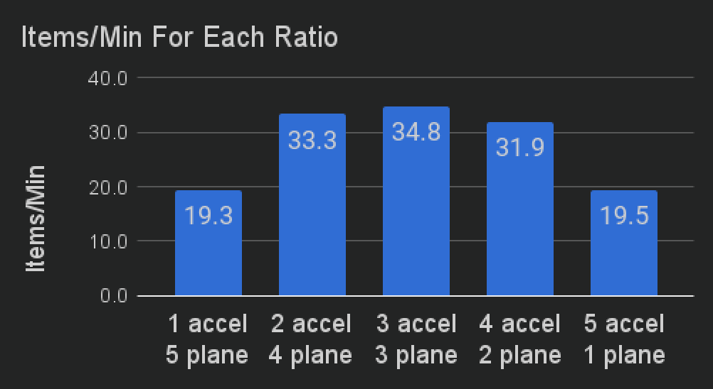

---
navigation:
  parent: ae2-mechanics/ae2-mechanics-index.md
  title: Рост истинного кварца
  icon: quartz_cluster
---

# Рост истинного кварца

## По сути, просто скопировано со страницы начала работы

<GameScene zoom="6" background="transparent">
<ImportStructure src="../assets/assemblies/budding_certus_1.snbt" />
</GameScene>

Почки истинного кварца будут появляться из [цветущих блоков истинного кварца](../items-blocks-machines/budding_certus.md), аналогично аметисту. Если вы сломаете почку, которая ещё не закончила
растить, она выпадет один <ItemLink id="certus_quartz_dust" />, не изменяется зачарованием Удачи. Если вы сломаете полностью выросший кластер, он выпадет четыре
<ItemLink id="certus_quartz_crystal" />, и Удача увеличит это число.

Существует 4 уровня цветущих блоков истинного кварца: Безупречный, Несовершенный, Потрескавшийся и Повреждённый, и вы изначально
находите их в [метеоритах](../ae2-mechanics/meteorites.md).

<GameScene zoom="4" background="transparent">
  <ImportStructure src="../assets/assemblies/budding_blocks.snbt" />
  <IsometricCamera yaw="195" pitch="30" />
</GameScene>

Каждый раз, когда почка растёт на следующем этапе, цветущий блок имеет шанс понизиться на один уровень, в конечном итоге превратившись в
простой блок истинного кварца. Их можно восстановить (и создать новые цветущие блоки), бросив цветущий блок (или
блок истинного кварца) в воду с одним или несколькими <ItemLink id="charged_certus_quartz_crystal" />.

<RecipeFor id="damaged_budding_quartz" />

Безупречные цветущие блоки истинного кварца не будут понижаться и будут генерировать истинный кварц бесконечно. Однако их нельзя создавать или перемещать
с помощью кирки, даже с шелковым касанием. (их *можно* перемещать с помощью [пространственного хранения](../ae2-mechanics/spatial-io.md), хотя)

Сами по себе почки истинного кварца растут очень медленно. К счастью, <ItemLink id="growth_accelerator" /> значительно
ускоряет этот процесс, когда размещается рядом с цветущим блоком. Вы должны построить несколько из них в качестве первого приоритета.

<GameScene zoom="4" background="transparent">
  <ImportStructure src="../assets/assemblies/budding_certus_2.snbt" />
  <IsometricCamera yaw="195" pitch="30" />
</GameScene>

Сложные взаимодействия означают, что каждая сторона цветущего блока, которая закрыта, замедляет совокупную скорость роста от цветущего блока,
что в конечном итоге преодолевает эффект от большего количества ускорителей. Эмпирическое тестирование показывает следующее:

Если у вас недостаточно кварца, чтобы также сделать <ItemLink id="energy_acceptor" /> или <ItemLink id="vibration_chamber" />,
вы можете сделать <ItemLink id="crank" /> и прикрепить его к концу ускорителя.

Автоматическая добыча истинного кварца описана [здесь](../example-setups/simple-certus-farm.md).