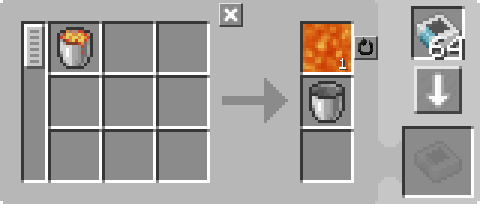
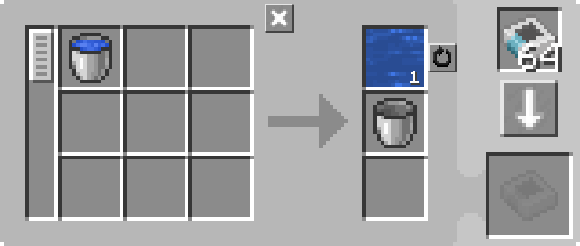

---
navigation:
  parent: example-setups/example-setups-index.md
  title: Опорожнитель ведра
  icon: minecraft:bucket
---

# Опорожнитель ведра

См. также [Наполнитель ведра](bucket-filler.md).

Обратите внимание, что поскольку эта установка использует <ItemLink id="pattern_provider" />, она предназначена для интеграции в вашу систему [автоматического крафта](../ae2-mechanics/autocrafting.md).

Иногда жизнь бывает неудобной, и вам нужна сама жидкость, но вы можете изготовить её только в ведре. Иногда машину, которая это делает, можно найти
(например, транспортер жидкостей из Thermal Expansion), но у вас может не всегда быть мода, который делает это удобно. К счастью,
в ванильном Minecraft есть способ чуть менее удобный — <ItemLink id="minecraft:dispenser" /> (раздатчик).

<GameScene zoom="6" interactive={true}>
  <ImportStructure src="../assets/assemblies/bucket_emptier.snbt" />

<BoxAnnotation color="#dddddd" min="2 1 0" max="3 2 1">
        (1) Поставщик шаблонов: Настроен на блокировку крафта "Сигналом редстоуна" и режим блокировки включен, с соответствующими шаблонами обработки.

        <Row>
        
        
        </Row>
  </BoxAnnotation>

<BoxAnnotation color="#dddddd" min="2.1 2 0.1" max="2.9 2.2 0.9">
        (2) Интерфейс: В конфигурации по умолчанию.
  </BoxAnnotation>

<BoxAnnotation color="#dddddd" min="3.1 2 1.1" max="3.9 2.2 1.9">
        (3) Шина хранения №1: В конфигурации по умолчанию.
  </BoxAnnotation>

<BoxAnnotation color="#dddddd" min="4.05 1.05 0.8" max="4.95 1.95 1">
        (4) Плоскость уничтожения: Не имеет интерфейса для настройки.
  </BoxAnnotation>

<BoxAnnotation color="#dddddd" min="3.2 1.2 0.8" max="3.8 1.8 1">
        (5) Шина импорта: Отфильтрована по ведрам.
        <ItemImage id="minecraft:bucket" scale="2" />
  </BoxAnnotation>

<BoxAnnotation color="#dddddd" min="3 1.1 0.1" max="3.2 1.9 0.9">
        (6) Шина хранения №2: В конфигурации по умолчанию.
  </BoxAnnotation>

<DiamondAnnotation pos="0 1.5 0.5" color="#00ff00">
        К основной сети
    </DiamondAnnotation>

  <IsometricCamera yaw="225" pitch="45" />
</GameScene>

## Настройки

* <ItemLink id="pattern_provider" /> (1) настроен на блокировку крафта "Сигналом редстоуна" и режим блокировки включен,
  с соответствующими <ItemLink id="processing_pattern" />.
  
    
    

* <ItemLink id="interface" /> (2) в конфигурации по умолчанию.
* Первая <ItemLink id="storage_bus" /> (3) в конфигурации по умолчанию.
* <ItemLink id="annihilation_plane" /> (4) не имеет интерфейса и не может быть настроен.
* <ItemLink id="import_bus" /> (5) отфильтрована по ведрам.
  <ItemImage id="minecraft:bucket" scale="2" />
* Вторая <ItemLink id="storage_bus" /> (6) в конфигурации по умолчанию.

## Как это работает

1. <ItemLink id="pattern_provider" /> помещает ингредиенты в <ItemLink id="interface" />.
   (На самом деле, в качестве оптимизации, он помещает их прямо через шину хранения, как если бы она была продолжением его граней. Предметы никогда на самом деле не попадают в интерфейс.)
2. С помощью механизмов, описанных в [подсетях с трубами](pipe-subnet.md#providing-to-multiple-places),
   ведро оказывается в <ItemLink id="minecraft:dispenser" />.
3. <ItemLink id="minecraft:comparator" /> обнаруживает ведро в раздатчике и одновременно подает на него питание и блокирует
   <ItemLink id="pattern_provider" />.
4. Раздатчик выливает жидкость из ведра, теперь в нем находится пустое ведро.
5. <ItemLink id="import_bus" /> извлекает пустое ведро из раздатчика и сохраняет его через
   <ItemLink id="storage_bus" /> в поставщик шаблонов, возвращая его в основную сеть.
6. Компаратор видит, что раздатчик пуст, разблокируя поставщик.