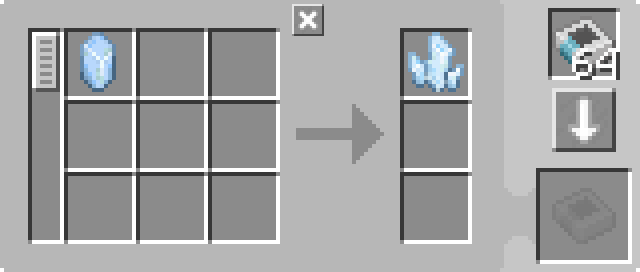

---
navigation:
  parent: example-setups/example-setups-index.md
  title: Автоматизация зарядки
  icon: charger
---

# Автоматизация зарядки

Обратите внимание, что поскольку это использует <ItemLink id="pattern_provider" />, он предназначен для интеграции в вашу настройку [автоматического крафта](../ae2-mechanics/autocrafting.md).
Если вы просто хотите автоматизировать <ItemLink id="charger" /> отдельно, используйте желоба, сундуки и прочее.

Автоматизация <ItemLink id="charger" /> довольно проста. <ItemLink id="pattern_provider" /> толкает ингредиент в зарядник, затем [подсеть труб](pipe-subnet.md)
или другая труба для предметов толкает результат обратно в поставщик.

<GameScene zoom="6" interactive={true}>
  <ImportStructure src="../assets/assemblies/charger_automation.snbt" />

<BoxAnnotation color="#dddddd" min="1 0 0" max="2 1 1">
        (1) Поставщик шаблонов: В конфигурации по умолчанию, с соответствующими шаблонами обработки. Также предоставляет заряднику энергию.

        
  </BoxAnnotation>

<BoxAnnotation color="#dddddd" min="0 1 0" max="1 1.3 1">
        (2) Шина импорта: В конфигурации по умолчанию.
  </BoxAnnotation>

<BoxAnnotation color="#dddddd" min="1 1 0" max="2 1.3 1">
        (3) Шина хранения: В конфигурации по умолчанию.
  </BoxAnnotation>

<DiamondAnnotation pos="4 0.5 0.5" color="#00ff00">
        В основную сеть
    </DiamondAnnotation>

  <IsometricCamera yaw="195" pitch="30" />
</GameScene>

## Конфигурации

* <ItemLink id="pattern_provider" /> (1) находится в конфигурации по умолчанию, с соответствующими <ItemLink id="processing_pattern" />.
  Он также предоставляет <ItemLink id="charger" /> [энергию](../ae2-mechanics/energy.md), потому что действует как [кабель](../items-blocks-machines/cables.md).
  
    

* <ItemLink id="import_bus" /> (2) находится в конфигурации по умолчанию.
* <ItemLink id="storage_bus" /> (3) находится в конфигурации по умолчанию.

## Как это работает

1. <ItemLink id="pattern_provider" /> толкает ингредиенты в <ItemLink id="charger" />.
2. Зарядник делает свою вещь по зарядке.
3. <ItemLink id="import_bus" /> на зелёной подсети вытаскивает результат из зарядника и пытается сохранить его в
   [сетевое хранилище](../ae2-mechanics/import-export-storage.md).
4. Единственное хранилище на зелёной подсети — это <ItemLink id="storage_bus" />, которая сохраняет полученные предметы в поставщике шаблонов, возвращая их в основную сеть.