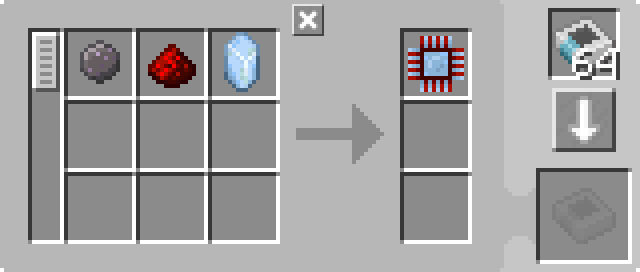

---
navigation:
  parent: example-setups/example-setups-index.md
  title: Автоматизация производства процессоров
  icon: logic_processor
---

# Автоматизация производства процессоров

Существует множество способов автоматизации [процессоров](../items-blocks-machines/processors.md), и это один из них.

Этот общий макет можно сделать с любым типом трубы для логистики предметов или кабеля или воздуховода или чем-то, что мод называет, при
условии, что вы можете отфильтровать его.

Вот подробно, как сделать это только с помощью AE2, используя [подсети "труб"](pipe-subnet.md).

Обратите внимание, что поскольку это использует <ItemLink id="pattern_provider" />, он предназначен для интеграции в вашу настройку [автоматического крафта](../ae2-mechanics/autocrafting.md).
Если вы просто хотите автоматизировать процессоры отдельно, замените поставщика шаблонов другим бочонком и прямо поместите ингредиенты в верхний бочонок.

Это совместимо
с предыдущими версиями AE2, потому что даже если <ItemLink id="inscriber" /> имеют стороны, подсети труб всё равно вставляют и
извлекают с правильных граней.

## Урок кодирования шаблонов

Часто [шаблон](../items-blocks-machines/patterns.md), который вам нужно закодировать, **НЕ СОВПАДЁТ С ТЕМ, ЧТО ВЫ ВИДИТЕ В JEI**, или что выводит JEI, когда вы нажимаете кнопку +.
В этом случае JEI выведет 2 отдельных шаблона, один для напечатанных компонентов и один для окончательной сборки, и шаблон напечатанных
компонентов будет включать [пресс](../items-blocks-machines/presses.md). Это не то, что нам нужно, потому что это не то, что будет делать настройка. Нам нужен 1 шаблон, который
вводит сырье и выводит готовый процессор, и поскольку пресс уже находится в высекателе, мы не должны помещать его в шаблон.

---

<GameScene zoom="4" interactive={true}>
  <ImportStructure src="../assets/assemblies/processor_automation.snbt" />

  <BoxAnnotation color="#dddddd" min="5 1 0" max="6 2 1" thickness=".05">
        (1) Поставщик шаблонов: В конфигурации по умолчанию, с соответствующими шаблонами обработки.

        <Row>
            
            
            
        </Row>
  </BoxAnnotation>

  <BoxAnnotation color="#dddddd" min="4.7 2 0" max="5 3 1" thickness=".05">
        (2) Шина хранения №1: В конфигурации по умолчанию.
  </BoxAnnotation>

  <BoxAnnotation color="#dddddd" min="4 1 0" max="4.3 2 1" thickness=".05">
        (3) Шина экспорта №1: Отфильтрована на Кремний, имеет 2 карты ускорения
        <Row><ItemImage id="silicon" scale="2" /> <ItemImage id="speed_card" scale="2" /></Row>
  </BoxAnnotation>

  <BoxAnnotation color="#dddddd" min="4 4 0" max="4.3 3 1" thickness=".05">
        (4) Шина экспорта №2: Отфильтрована на Слиток золота, имеет 2 карты ускорения
        <Row><ItemImage id="minecraft:gold_ingot" scale="2" /> <ItemImage id="speed_card" scale="2" /></Row>
  </BoxAnnotation>

  <BoxAnnotation color="#dddddd" min="4 5 0" max="4.3 4 1" thickness=".05">
        (5) Шина экспорта №3: Отфильтрована на Кристалл истинного кварца, имеет 2 карты ускорения
        <Row><ItemImage id="certus_quartz_crystal" scale="2" /> <ItemImage id="speed_card" scale="2" /></Row>
  </BoxAnnotation>

  <BoxAnnotation color="#dddddd" min="4 6 0" max="4.3 5 1" thickness=".05">
        (6) Шина экспорта №4: Отфильтрована на Алмаз, имеет 2 карты ускорения
        <Row><ItemImage id="minecraft:diamond" scale="2" /> <ItemImage id="speed_card" scale="2" /></Row>
  </BoxAnnotation>

  <BoxAnnotation color="#dddddd" min="2.3 3 0" max="2 2 1" thickness=".05">
        (7) Шина экспорта №5: Отфильтрована на Пыль красного камня, имеет 2 карты ускорения
        <Row><ItemImage id="minecraft:redstone" scale="2" /> <ItemImage id="speed_card" scale="2" /></Row>
  </BoxAnnotation>

  <BoxAnnotation color="#dddddd" min="4 1 0" max="3 2 1" thickness=".05">
        (8) Высекатель №1: В конфигурации по умолчанию. Имеет Пресс кремния и 4 карты ускорения
        <Row><ItemImage id="silicon_press" scale="2" /> <ItemImage id="speed_card" scale="2" /></Row>
  </BoxAnnotation>

  <BoxAnnotation color="#dddddd" min="4 3 0" max="3 4 1" thickness=".05">
        (9) Высекатель №2: В конфигурации по умолчанию. Имеет Пресс логического процессора и 4 карты ускорения
        <Row><ItemImage id="logic_processor_press" scale="2" /> <ItemImage id="speed_card" scale="2" /></Row>
  </BoxAnnotation>

  <BoxAnnotation color="#dddddd" min="4 4 0" max="3 5 1" thickness=".05">
        (10) Высекатель №3: В конфигурации по умолчанию. Имеет Пресс вычислительного процессора и 4 карты ускорения
        <Row><ItemImage id="calculation_processor_press" scale="2" /> <ItemImage id="speed_card" scale="2" /></Row>
  </BoxAnnotation>

  <BoxAnnotation color="#dddddd" min="4 5 0" max="3 6 1" thickness=".05">
        (11) Высекатель №4: В конфигурации по умолчанию. Имеет Пресс инженерного процессора и 4 карты ускорения
        <Row><ItemImage id="engineering_processor_press" scale="2" /> <ItemImage id="speed_card" scale="2" /></Row>
  </BoxAnnotation>

  <BoxAnnotation color="#dddddd" min="2 2 0" max="1 3 1" thickness=".05">
        (12) Высекатель №5: В конфигурации по умолчанию. Имеет 4 карты ускорения
        <ItemImage id="speed_card" scale="2" />
  </BoxAnnotation>

  <BoxAnnotation color="#dddddd" min="2.7 2 0" max="3 1 1" thickness=".05">
        (13) Шина импорта №1: В конфигурации по умолчанию, имеет 2 карты ускорения
        <ItemImage id="speed_card" scale="2" />
  </BoxAnnotation>

  <BoxAnnotation color="#dddddd" min="2.7 4 0" max="3 3 1" thickness=".05">
        (14) Шина импорта №2: В конфигурации по умолчанию, имеет 2 карты ускорения
        <ItemImage id="speed_card" scale="2" />
  </BoxAnnotation>

  <BoxAnnotation color="#dddddd" min="2.7 5 0" max="3 4 1" thickness=".05">
        (15) Шина импорта №3: В конфигурации по умолчанию, имеет 2 карты ускорения
        <ItemImage id="speed_card" scale="2" />
  </BoxAnnotation>

  <BoxAnnotation color="#dddddd" min="2.7 6 0" max="3 5 1" thickness=".05">
        (16) Шина импорта №4: В конфигурации по умолчанию, имеет 2 карты ускорения
        <ItemImage id="speed_card" scale="2" />
  </BoxAnnotation>

  <BoxAnnotation color="#dddddd" min="2 3 0" max="1 3.3 1" thickness=".05">
        (17) Шина хранения №2: В конфигурации по умолчанию.
  </BoxAnnotation>

  <BoxAnnotation color="#dddddd" min="2 1.7 0" max="1 2 1" thickness=".05">
        (18) Шина хранения №3: В конфигурации по умолчанию.
  </BoxAnnotation>

  <BoxAnnotation color="#dddddd" min="1 2 0" max="0.7 3 1" thickness=".05">
        (19) Шина импорта №5: В конфигурации по умолчанию, имеет 2 карты ускорения
        <ItemImage id="speed_card" scale="2" />
  </BoxAnnotation>

  <BoxAnnotation color="#dddddd" min="5 0.7 0" max="6 1 1" thickness=".05">
        (20) Шина хранения №4: В конфигурации по умолчанию.
  </BoxAnnotation>

<BoxAnnotation color="#dddddd" min="3.3 2.7 0.3" max="3.7 3 0.7" thickness=".05">
        Кварцевое волокно питает все 3 высекателя, потому что высекатели действуют как кабели и таким образом передают энергию
  </BoxAnnotation>

<DiamondAnnotation pos="7 1.5 0.5" color="#00ff00">
        В основную сеть
    </DiamondAnnotation>

  <IsometricCamera yaw="185" pitch="5" />
</GameScene>

## Конфигурации

* <ItemLink id="pattern_provider" /> (1) находится в конфигурации по умолчанию, с соответствующими <ItemLink id="processing_pattern" />.
  Обратите внимание, что шаблоны идут напрямую от сырья к готовому процессору, и **НЕ** включают [пресс](../items-blocks-machines/presses.md).

  
  
  

* <ItemLink id="storage_bus" /> (2, 17, 18, 20) находятся в конфигурации по умолчанию.
* <ItemLink id="export_bus" /> (3-7) отфильтрованы на соответствующий ингредиент. У них есть 2 <ItemLink id="speed_card" />.
    <Row>
      <ItemImage id="silicon" scale="2" />
      <ItemImage id="minecraft:gold_ingot" scale="2" />
      <ItemImage id="certus_quartz_crystal" scale="2" />
      <ItemImage id="minecraft:diamond" scale="2" />
      <ItemImage id="minecraft:redstone" scale="2" />
    </Row>
* <ItemLink id="import_bus" /> (13-16, 19) находятся в конфигурации по умолчанию. У них есть 2 <ItemLink id="speed_card" />.
* <ItemLink id="inscriber" /> находятся в конфигурации по умолчанию. У них есть соответствующий [пресс](../items-blocks-machines/presses.md),
   и 4 <ItemLink id="speed_card" />.
   <Row>
     <ItemImage id="silicon_press" scale="2" />
     <ItemImage id="logic_processor_press" scale="2" />
     <ItemImage id="calculation_processor_press" scale="2" />
     <ItemImage id="engineering_processor_press" scale="2" />
   </Row>

## Как это работает

1. <ItemLink id="pattern_provider" /> толкает ингредиенты в бочонок.
2. Первая [подсеть "труб"](pipe-subnet.md) (оранжевая) вытаскивает кремний, пыль красного камня и ингредиент соответствующего процессора
   (Слиток золота, Кристалл истинного кварца или Алмаз) из бочонка и помещает их в соответствующий <ItemLink id="inscriber" />.
3. Первые четыре <ItemLink id="inscriber" /> создают <ItemLink id="printed_silicon" />, и <ItemLink id="printed_logic_processor" />,
   <ItemLink id="printed_calculation_processor" />, или <ItemLink id="printed_engineering_processor" />.
4. Вторая и третья [подсети "труб"](pipe-subnet.md) (зелёные) забирают напечатанные схемы из первых четырёх <ItemLink id="inscriber" />
    и помещают их в пятый, окончательный сборочный <ItemLink id="inscriber" />.
5. Пятый <ItemLink id="inscriber" /> собирает [процессор](../items-blocks-machines/processors.md).
6. Четвёртая [подсеть "труб"](pipe-subnet.md) (фиолетовая) помещает процессор в поставщик шаблонов, возвращая его в основную сеть.