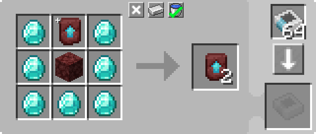

---
navigation:
  parent: example-setups/example-setups-index.md
  title: Рекурсивный крафт
  icon: minecraft:netherite_upgrade_smithing_template
---

# Настройка рекурсивного крафта

Как указано в [автоматическом крафте](../ae2-mechanics/autocrafting.md), алгоритм планирования автоматического крафта не может обрабатывать рецепты, где
основной выход является одним из входов. Например, он не может обрабатывать клонирование <ItemLink id="minecraft:netherite_upgrade_smithing_template" />.

Одно из решений — использование способности <ItemLink id="level_emitter" /> притворяться [шаблоном](../items-blocks-machines/patterns.md).

Затем это будет использоваться для включения небольшой настройки, которая постоянно выполняет крафт. В этом случае мы рассмотрим настройку
для клонирования <ItemLink id="minecraft:netherite_upgrade_smithing_template" />.

<RecipeFor id="minecraft:netherite_upgrade_smithing_template" />

***

<GameScene zoom="6" interactive={true}>
  <ImportStructure src="../assets/assemblies/recursive_recipe_setup.snbt" />

  <BoxAnnotation color="#dddddd" min="1 0 0" max="2 1 1">
        (1) Интерфейс: настроен на хранение необходимых дополнительных ингредиентов: алмаз и незеррак.
        <Row><ItemImage id="minecraft:diamond" scale="2" /> <ItemImage id="minecraft:netherrack" scale="2" /></Row>
  </BoxAnnotation>

  <BoxAnnotation color="#dddddd" min="2.3 1 0.3" max="2.7 1.3 0.7">
        (2) Излучатель уровня: Настроен на "шаблон кузнечного дела незерита", установлен на "Излучать красный камень для создания предмета".
        <Row><ItemImage id="minecraft:netherite_upgrade_smithing_template" scale="2" /> <ItemImage id="crafting_card" scale="2" /></Row>
  </BoxAnnotation>

  <BoxAnnotation color="#dddddd" min="2 0 0" max="2.3 1 1">
        (3) Шина импорта №1: Отфильтрована на предметы, которые хранит Интерфейс. Имеет Карту красного камня. Режим красного камня установлен на
        "Активен при сигнале".
        <Row>
        <ItemImage id="minecraft:diamond" scale="2" />
        <ItemImage id="minecraft:netherrack" scale="2" />
        <ItemImage id="redstone_card" scale="2" />
        </Row>
  </BoxAnnotation>

  <BoxAnnotation color="#dddddd" min="3 1 1" max="4 1.3 2">
        (4) Шина хранения №1: Установлена на более высокий приоритет, чем другая шина хранения. ОЧЕНЬ ВАЖНО.
  </BoxAnnotation>

  <BoxAnnotation color="#dddddd" min="3 0 1" max="4 1 2">
        (5) Молекулярный сборщик: В нём находится шаблон для дублирования шаблона кузнечного дела.
        

        Также в него уже вставлен один шаблон кузнечного дела вручную при первом создании этой настройки.
  </BoxAnnotation>

  <BoxAnnotation color="#dddddd" min="2.7 0 1" max="3 1 2">
        (6) Шина импорта №2: В конфигурации по умолчанию.
  </BoxAnnotation>

  <BoxAnnotation color="#dddddd" min="1 0 1" max="2 1 1.3">
        (7) Шина хранения №2: Отфильтрована на "шаблон кузнечного дела незерита". Установлена на более низкий приоритет, чем другая шина хранения.
        <ItemImage id="minecraft:netherite_upgrade_smithing_template" scale="2" />
  </BoxAnnotation>

<DiamondAnnotation pos="0 0.5 0.5" color="#00ff00">
        В основную сеть
    </DiamondAnnotation>

  <IsometricCamera yaw="15" pitch="30" />
</GameScene>

## Конфигурации

* <ItemLink id="interface" /> (1) настроен на хранение необходимых дополнительных ингредиентов: алмаз и незеррак.
* <ItemLink id="level_emitter" /> (2) настроен на "шаблон кузнечного дела незерита" и установлен на "Излучать красный камень для создания предмета".
* Первая <ItemLink id="import_bus" /> (3) отфильтрована на предметы, которые хранит Интерфейс. У неё есть Карта красного камня. Режим красного камня установлен на "Активен при сигнале".
* Первая <ItemLink id="storage_bus" /> (4) установлена на *более высокий* [приоритет](../ae2-mechanics/import-export-storage.md#storage-priority), чем вторая шина хранения.
* <ItemLink id="molecular_assembler" /> (5) имеет шаблон для дублирования шаблона кузнечного дела и один шаблон кузнечного дела уже вставлен вручную.

  

* Вторая <ItemLink id="import_bus" /> (6) находится в конфигурации по умолчанию.
* Вторая <ItemLink id="storage_bus" /> (7) отфильтрована на "шаблон кузнечного дела незерита". У неё *ниже* [приоритет](../ae2-mechanics/import-export-storage.md#storage-priority), чем у первой шины хранения.

## Как это работает

1. <ItemLink id="level_emitter" /> притворяется [шаблоном](../items-blocks-machines/patterns.md) из-за вставленной
   <ItemLink id="crafting_card" /> и установки на "Излучать красный камень для создания предмета". Таким образом, "шаблон кузнечного дела незерита" появляется в
   [терминалах](../items-blocks-machines/terminals.md) как валидный предмет для [автоматического крафта](../ae2-mechanics/autocrafting.md).
2. При получении запроса на создание этого предмета, либо от игрока, либо от самой системы, излучатель уровня включается.
3. Первая <ItemLink id="import_bus" /> активируется излучателем уровня и вытаскивает ингредиенты, хранящиеся в <ItemLink id="interface" />.
4. Единственная <ItemLink id="storage_bus" />, которая может хранить эти ингредиенты в сети, — это та, что находится на сборщике.
5. <ItemLink id="molecular_assembler" /> получает ингредиенты (уже имея 1 шаблон кузнечного дела внутри) и выполняет крафт, производя 2 шаблона кузнечного дела.
6. Вторая <ItemLink id="import_bus" /> извлекает 1 шаблон кузнечного дела.
7. Первая шина хранения имеет более высокий приоритет, поэтому этот шаблон кузнечного дела возвращается в сборщик.
8. Вторая <ItemLink id="import_bus" /> извлекает 1 шаблон кузнечного дела.
9. Сборщик не может принять ещё один шаблон кузнечного дела, поэтому второй шаблон кузнечного дела идёт на шину хранения с более низким приоритетом, вставляя его в интерфейс.
10. <ItemLink id="interface" />, не будучи настроенным на хранение шаблонов кузнечного дела, вставляет его в сеть.