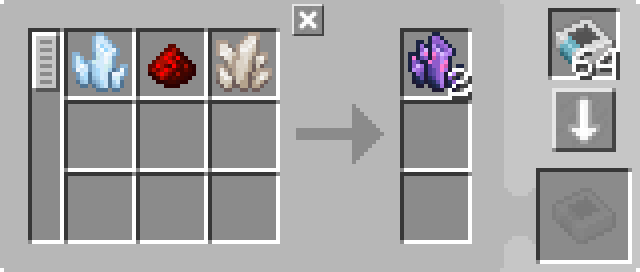

---
navigation:
  parent: example-setups/example-setups-index.md
  title: Автоматизация бросания в воду
  icon: fluix_crystal
---

# Автоматизация рецептов бросания в воду

Обратите внимание, что поскольку это использует <ItemLink id="pattern_provider" />, он предназначен для интеграции в вашу настройку [автоматического крафта](../ae2-mechanics/autocrafting.md).

Некоторые рецепты требуют, чтобы предметы бросали в воду (хотя похожая настройка может использоваться для бросания предметов в другие места).
Это можно автоматизировать с помощью <ItemLink id="formation_plane" />, <ItemLink id="annihilation_plane" /> и некоторой вспомогательной
инфраструктуры (по сути, это 2 изменённые [подсети труб](pipe-subnet.md)).

Эта настройка предназначена для использования в сочетании с [автоматизацией зарядки](charger-automation.md) для предоставления <ItemLink id="charged_certus_quartz_crystal" />.

<GameScene zoom="6" interactive={true}>
  <ImportStructure src="../assets/assemblies/throw_in_water.snbt" />

<BoxAnnotation color="#dddddd" min="2 0 1" max="3 1 2">
        (1) Поставщик шаблонов: В конфигурации по умолчанию, с соответствующими шаблонами обработки.

         
  </BoxAnnotation>

<BoxAnnotation color="#dddddd" min="1.7 0 1" max="2 1 2">
        (2) Интерфейс: В конфигурации по умолчанию.
  </BoxAnnotation>

<BoxAnnotation color="#dddddd" min="1 .7 1" max="2 1 2">
        (3) Плоскость формирования: Настроена на выбрасывание входов в виде предметов.
  </BoxAnnotation>

<BoxAnnotation color="#dddddd" min="1 2 1" max="2 2.3 2">
        (4) Плоскость уничтожения: Не имеет интерфейса для настройки.
  </BoxAnnotation>

<BoxAnnotation color="#dddddd" min="2 1 1" max="3 1.3 2">
        (5) Шина хранения: Отфильтрована на выходы шаблонов
        <Row><ItemImage id="fluix_crystal" scale="2" /><BlockImage id="flawless_budding_quartz" scale="2" /></Row>
  </BoxAnnotation>

<DiamondAnnotation pos="3.9 0.5 1.5" color="#00ff00">
        В основную сеть и автоматизацию зарядки
        <GameScene zoom="3" background="transparent">
          <ImportStructure src="../assets/assemblies/charger_automation.snbt" />
          <IsometricCamera yaw="195" pitch="30" />
        </GameScene>
    </DiamondAnnotation>

  <IsometricCamera yaw="180" pitch="0" />
</GameScene>

## Конфигурации и шаблоны

* <ItemLink id="pattern_provider" /> (1) находится в конфигурации по умолчанию, с соответствующими <ItemLink id="processing_pattern" />
  * Для <ItemLink id="fluix_crystal" /> шаблон по умолчанию из JEI/REI работает нормально:

    

  * Для <ItemLink id="flawed_budding_quartz" /> вероятно лучше сделать его напрямую из <ItemLink id="quartz_block" />,
    что позволяет избежать проблем с тем, что вход одного рецепта является выходом другого, что мешает шине хранения фильтровать:
    

* <ItemLink id="interface" /> (2) находится в конфигурации по умолчанию.
* <ItemLink id="formation_plane" /> (3) настроена на выбрасывание входов в виде предметов.
* <ItemLink id="annihilation_plane" /> (4) не имеет интерфейса и не может быть настроена.
* <ItemLink id="storage_bus" /> (5) отфильтрована на выходы шаблонов.

## Как это работает

1.  <ItemLink id="pattern_provider" /> толкает ингредиенты в <ItemLink id="interface" /> с его стороны, на зелёной подсети
2.  Интерфейс (настроенный по умолчанию не хранить ничего) пытается толкнуть своё содержимое в [сетевое хранилище](../ae2-mechanics/import-export-storage.md)
3.  Единственное хранилище на зелёной подсети — это <ItemLink id="formation_plane" />, которая выбрасывает полученные предметы в воду
4.  <ItemLink id="annihilation_plane" /> на оранжевой подсети пытается подобрать только что выброшенные предметы, но не может, потому что
    <ItemLink id="storage_bus" /> сверху поставщика шаблонов (единственное хранилище на оранжевой подсети) отфильтрована только на принятие результатов возможных крафтов
5.  Предметы выполняют своё преобразование в мире.
6.  Теперь плоскость уничтожения может подобрать предметы перед собой, так как шине хранения разрешено их хранить.
7.  Шина хранения сохраняет полученные предметы в поставщике шаблонов, возвращая их в сеть.
