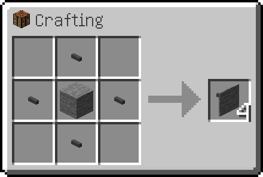

---
navigation:
  parent: items-blocks-machines/items-blocks-machines-index.md
  title: Фасады
  icon: facade
  icon_components:
    "ae2:facade_item": "minecraft:stone"
  position: 110
categories:
- network infrastructure
item_ids:
- ae2:facade
---

# Фасады

Фасады можно использовать, чтобы сделать вашу базу более чистой. Они могут закрывать кабели обоих размеров и изготавливаться из многих видов блоков.

<GameScene zoom="6" background="transparent">
  <ImportStructure src="../assets/assemblies/facades_1.snbt" />
  <IsometricCamera yaw="195" pitch="30" />
</GameScene>

Они могут закрывать все стороны кабеля, но позволят [подчастям](../ae2-mechanics/cable-subparts.md) и соединениям кабелей выступать наружу.

<GameScene zoom="6"  interactive={true}>
  <ImportStructure src="../assets/assemblies/facades_2.snbt" />
  <IsometricCamera yaw="195" pitch="30" />
</GameScene>

Будьте изобретательны с ними, чтобы улучшить эстетику вашей базы или создать блоки с разными текстурами на каждой стороне.

<GameScene zoom="4" interactive={true}>
  <ImportStructure src="../assets/assemblies/facades_3.snbt" />
  <IsometricCamera yaw="195" pitch="30" />
</GameScene>

## Скрытие фасадов

Фасады будут скрыты при удерживании <a href="network_tool.md">сетевого инструмента</a> в любой руке.

Вы можете взаимодействовать с блоками за скрытыми фасадами, не снимая фасады.

## Рецепт

Поместите блок, текстуру которого вы хотите, в центр 4 <ItemLink id="cable_anchor" />.

