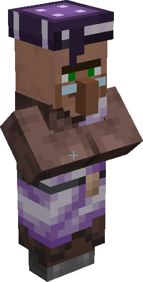

---
navigation:
  parent: items-blocks-machines/items-blocks-machines-index.md
  title: Исследователь флюкса (житель)
  icon: minecraft:emerald
  position: 310
categories:
- tools
---

# Исследователь флюкса

<Row>

<BlockImage id="charger" scale="8" />
</Row>

Исследователь флюкса — это профессия жителя. Соответствующее рабочее место — это <ItemLink id="charger" />.

## Торговля

Торговля следует стандартной структуре, открывая случайный выбор из 2 сделок на каждом уровне (если на этом уровне не только 1 возможная сделка)

| Уровень      | Требуемый предмет                                       | Получаемый предмет                                      |
|------------|---------------------------------------------------|-------------------------------------------------|
| Новичок     | 3 <ItemLink id="minecraft:emerald" />             | 4 <ItemLink id="certus_quartz_crystal" />       |
| Новичок     | 2 <ItemLink id="minecraft:emerald" />             | 1 <ItemLink id="meteorite_compass" />           |
|            |                                                   |                                                 |
| Ученик | 3 <ItemLink id="charged_certus_quartz_crystal" /> | 1 <ItemLink id="minecraft:emerald" />           |
| Ученик | 5 <ItemLink id="silicon" />                       | 1 <ItemLink id="minecraft:emerald" />           |
| Ученик | 5 <ItemLink id="minecraft:emerald" />             | 8 <ItemLink id="sky_stone_block" />             |
|            |                                                   |                                                 |
| Подмастерье | 2 <ItemLink id="quartz_glass" />                  | 1 <ItemLink id="minecraft:emerald" />           |
| Подмастерье | 5 <ItemLink id="minecraft:emerald" />             | 4 <ItemLink id="fluix_crystal" />               |
|            |                                                   |                                                 |
| Эксперт     | 5 <ItemLink id="matter_ball" />                   | 1 <ItemLink id="minecraft:emerald" />           |
| Эксперт     | 10 <ItemLink id="minecraft:emerald" />            | 1 <ItemLink id="silicon_press" />               |
| Эксперт     | 10 <ItemLink id="minecraft:emerald" />            | 1 <ItemLink id="logic_processor_press" />       |
| Эксперт     | 10 <ItemLink id="minecraft:emerald" />            | 1 <ItemLink id="calculation_processor_press" /> |
| Эксперт     | 10 <ItemLink id="minecraft:emerald" />            | 1 <ItemLink id="engineering_processor_press" /> |
|            |                                                   |                                                 |
| Мастер     | 8 <ItemLink id="minecraft:emerald" />             | 5 <ItemLink id="minecraft:slime_ball" />        |