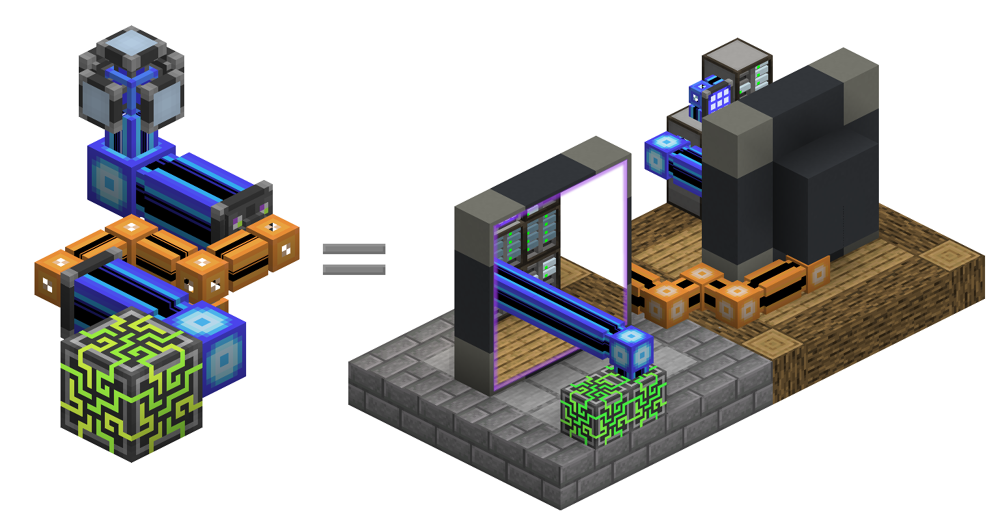

---
navigation:
  parent: items-blocks-machines/items-blocks-machines-index.md
  title: Тоннели точка-точка
  icon: me_p2p_tunnel
  position: 210
categories:
- devices
item_ids:
- ae2:me_p2p_tunnel
- ae2:redstone_p2p_tunnel
- ae2:item_p2p_tunnel
- ae2:fluid_p2p_tunnel
- ae2:fe_p2p_tunnel
- ae2:light_p2p_tunnel
---

# Тоннели точка-точка

<GameScene zoom="6" background="transparent">
  <ImportStructure src="../assets/assemblies/p2p_tunnels.snbt" />
  <IsometricCamera yaw="195" pitch="30" />
</GameScene>

Тоннели P2P — это способ перемещения таких вещей, как предметы, жидкости, сигналы красного камня, энергия, свет и [каналы](../ae2-mechanics/channels.md) по сети, не взаимодействуя с сетью напрямую. Существует множество разновидностей тоннелей P2P, но каждый из них транспортирует только определённый тип вещей. По сути, они действуют как порталы, которые напрямую соединяют две грани блоков на расстоянии. Они не являются двунаправленными, есть определённые входы и выходы.

Например, желоб, направленный на тоннель P2P для предметов, будет действовать так, будто он напрямую подключён к бочке, и предметы будут течь.

<GameScene zoom="4" background="transparent">
  <ImportStructure src="../assets/assemblies/p2p_hopper_barrel.snbt" />
  <IsometricCamera yaw="195" pitch="30" />
</GameScene>

Однако две бочки рядом друг с другом не будут передавать предметы между собой.

<GameScene zoom="4" background="transparent">
  <ImportStructure src="../assets/assemblies/p2p_barrel_barrel.snbt" />
  <IsometricCamera yaw="195" pitch="30" />
</GameScene>

Также существуют и другие разновидности, такие как P2P для красного камня.

<GameScene zoom="4" background="transparent">
  <ImportStructure src="../assets/assemblies/p2p_redstone.snbt" />
  <IsometricCamera yaw="195" pitch="30" />
</GameScene>

И ME P2P, который перемещает каналы.

<GameScene zoom="4" background="transparent">
  <ImportStructure src="../assets/assemblies/p2p_channels.snbt" />
  <IsometricCamera yaw="195" pitch="30" />
</GameScene>

## Типы тоннелей P2P и сопряжение

<GameScene zoom="6" background="transparent">
  <ImportStructure src="../assets/assemblies/p2p_tunnels.snbt" />
  <IsometricCamera yaw="180" pitch="90" />
</GameScene>

Существует множество типов тоннелей P2P. Только тоннель ME P2P можно создать напрямую, другие создаются с помощью правого клика по другим тоннелям P2P определёнными предметами:

- Тоннели ME P2P выбираются с помощью правого клика любым [кабелем](../items-blocks-machines/cables.md).
- Тоннели P2P для красного камня выбираются с помощью правого клика различными компонентами красного камня.
- Тоннели P2P для предметов выбираются с помощью правого клика сундуком или желобом.
- Тоннели P2P для жидкостей выбираются с помощью правого клика ведром или бутылкой.
- Тоннели P2P для энергии выбираются с помощью правого клика почти любым предметом, содержащим энергию.
- Тоннели P2P для света выбираются с помощью правого клика факелом или светящимся камнем

Некоторые типы тоннелей имеют особенности. Например, каналы тоннелей ME P2P не могут проходить через другие тоннели ME P2P, а тоннели P2P для энергии косвенно извлекают налог в 2,5% от FE, протекающего через них, увеличивая своё [энергопотребление](../ae2-mechanics/energy.md).

## Наиболее распространённая форма P2P

Наиболее распространённый случай использования тоннелей P2P — это использование тоннеля ME P2P для компактной передачи [каналов](../ae2-mechanics/channels.md). Вместо пучка плотных кабелей один плотный кабель может использоваться для передачи множества каналов.

В этом примере 8 входов ME P2P забирают 256 каналов (8*32) от <ItemLink id="controller" /> основной сети, а 8 выходов ME P2P выводят их в другое место. Обратите внимание, как каждый вход или выход тоннеля P2P занимает 1 канал. Таким образом, мы можем передавать множество каналов по тонкому кабелю. И поскольку наши тоннели P2P находятся в выделенной [подсети](../ae2-mechanics/subnetworks.md), мы даже не используем никаких каналов из основной сети для этого! Также обратите внимание, как, хотя тоннели P2P можно размещать непосредственно рядом с контроллером, между ними можно разместить [плотный умный кабель](../items-blocks-machines/cables.md#smart-cable), чтобы легче визуализировать каналы.

<GameScene zoom="4" interactive={true}>
  <ImportStructure src="../assets/assemblies/p2p_compact_channels.snbt" />

  <BoxAnnotation color="#dddddd" min="1.3 1.3 6.3" max="2 2.7 6.7">
        Кварцевое волокно разделяет энергию между основной сетью и подсетью p2p.
  </BoxAnnotation>

  <BoxAnnotation color="#dddddd" min="4.1 0 5.7" max="5 2.3 6.4">
        Вы можете либо поместить вход тоннеля непосредственно на контроллер, либо подключить к нему кабель.
  </BoxAnnotation>

  <IsometricCamera yaw="225" pitch="30" />
</GameScene>

Для другого примера (включая его использование с [квантовыми мостами](quantum_bridge.md)) см. эту диаграмму в MS Paint, которую мне лень редактировать:

## Вложенность

Однако вы не можете использовать это для передачи бесконечного количества каналов по одному кабелю. Канал для тоннеля ME P2P не будет проходить через другой тоннель ME P2P, поэтому вы не можете вкладывать их рекурсивно. Обратите внимание, как внешний слой тоннелей ME P2P на красных кабелях неактивен. Обратите внимание, что это относится только к тоннелям ME P2P, другие типы тоннелей P2P могут проходить через тоннель ME P2P, как видно по тому, что тоннели P2P для красного камня работают нормально.

<GameScene zoom="4" background="transparent">
  <ImportStructure src="../assets/assemblies/p2p_nesting.snbt" />
  <IsometricCamera yaw="225" pitch="30" />
</GameScene>

## Сопряжение

<GameScene zoom="6" background="transparent">
  <ImportStructure src="../assets/assemblies/p2p_linking_frequency.snbt" />
  <IsometricCamera yaw="195" pitch="30" />
</GameScene>

Концы соединения тоннеля P2P можно сопрячь с помощью <ItemLink id="memory_card" />. Частота будет отображаться в виде массива 2x2 цветов на задней стороне тоннеля.

- Щёлкните правой кнопкой мыши с зажатым Shift, чтобы сгенерировать новую частоту сопряжения P2P.
- Щёлкните правой кнопкой мыши, чтобы вставить настройки, карты улучшений или частоту сопряжения.

Тоннель, по которому вы щёлкнули правой кнопкой мыши с зажатым Shift, будет входом, а тоннель, по которому вы щёлкнули правой кнопкой мыши, будет выходом. Вы можете иметь несколько выходов, но с тоннелями ME P2P каналы, поступающие на вход, будут разделены между выходами, поэтому вы не можете дублировать каналы.

## Рецепт

<RecipeFor id="me_p2p_tunnel" />